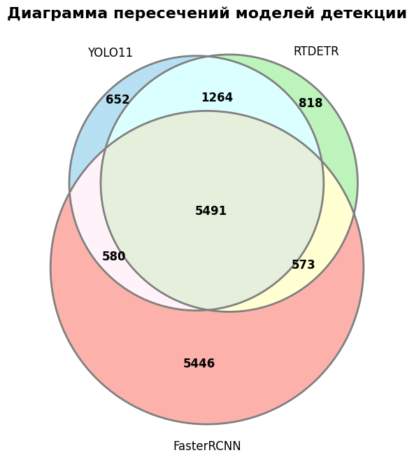

# Object Detection on Video

Скрипт для детекции людей на видео с использованием различных моделей:

* **YOLOv11** - Быстрая и лёгкая one-stage модель для real-time детекции.
* **Faster R-CNN** - Точная two-stage модель.
* **RTDETR** - Трансформер-модель для real-time детекции.

Скрипт выводит FPS и записывает видео с отрисованными bounding box.

---

## Установка

1. **Клонировать репозиторий:**

```bash
git clone https://github.com/NickS0kolov/detection_models_comparison.git
cd detection_models_comparison
```

2. **Установить зависимости:**

```bash
pip install -r requirements.txt
```

3. **Запустить скрипт для одной модели:**

Выбор модели: ["yolo", "frcnn", "rtdetr"]
```bash
python main.py --model rtdetr --video_path path/to/video.mp4 --save_path path/to/output.mp4
```

4. **Запуск скрипта для сравнения предсказаний всех моделей:**

```bash
python models_comparison.py --video_path path/to/video.mp4 --save_path path/to/output.mp4
```

---

## Результаты моделей

### YOLOv11

```
Всего кадров: 705
Общее время пайплайна: 24.75 с
Средний FPS пайплайна: 28.48
Средний FPS модели: 59.81
Время инференса модели: 16.7 мс/кадр
```

### RTDETR

```
Всего кадров: 705
Общее время пайплайна: 40.62 с
Средний FPS пайплайна: 17.36
Средний FPS модели: 25.34
Время инференса модели: 39.5 мс/кадр
```

### Faster R-CNN

```
Всего кадров: 705
Общее время пайплайна: 160.66 с
Средний FPS пайплайна: 4.39
Средний FPS модели: 4.90
Время инференса модели: 204.2 мс/кадр
```

---

## Сравнение моделей
```
СТАТИСТИКА КОМБИНАЦИЙ ДЕТЕКЦИЙ:
YOLO11+RTDETR+FasterRCNN = 5491
YOLO11+RTDETR   = 1264
YOLO11+FasterRCNN = 580
RTDETR+FasterRCNN = 573
YOLO11          = 652
RTDETR          = 818
FasterRCNN      = 5446
```


## Примеры детекции


## Вывод по сравнению

- YOLOv11 обеспечивает наибольшую скорость и подходит для обработки видео в реальном времени, но иногда пропускает мелкие объекты. Низкая уверенность в некоторых предсказаниях указывает на возможные сомнения модели.

- RTDETR представляет собой компромисс между скоростью и точностью, обеспечивая более сбалансированное решение.

- Faster R-CNN крайне медленная, но при этом может фиксировать больше уникальных объектов и давать более точные детекции на каждом кадре, что делает её полезной, если приоритет - качество, а не скорость.

- Все модели показывают слабый результат при перекрывающихся объектах.

## Шаги для улучшения предсказаний:

- Дообучение моделей на данных с плотными скоплениями людей, чтобы модели лучше распознавали объекты в сложных сценах.

- Подобрать оптимальные значения для моделей и трекера, чтобы повысить точность и стабильность детекций.

- Настроить модели и пайплайны для эффективного использования GPU, что повысит скорость инференса и уменьшит задержку (TensorRT, ONNX Runtime)

- Если не стоит задача real-time детекции можно использовать батчевую обработку кадров.

- Увеличение разрешения видео (поможет с точностью на мелких объектах).

- Постобработка детекций (Non-Maximum Suppression c оптимальными порогами, Сглаживание треков).
